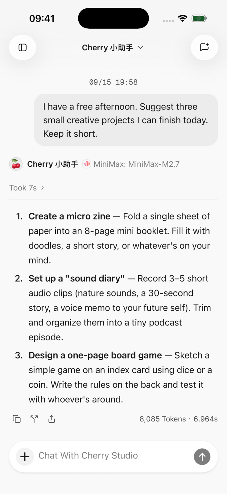
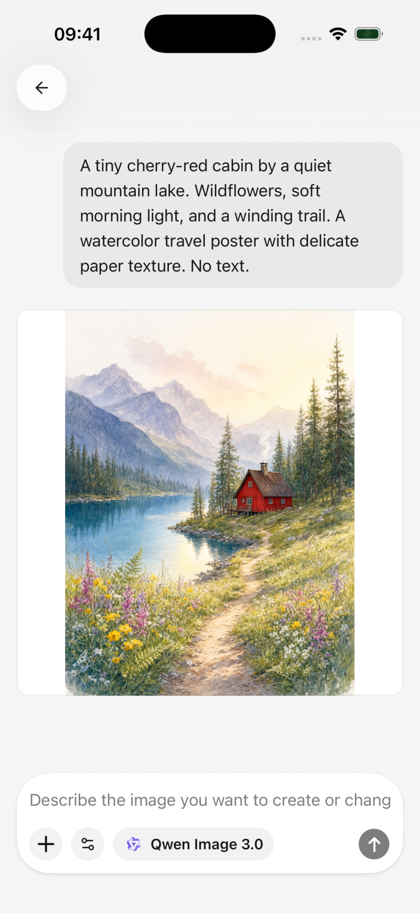
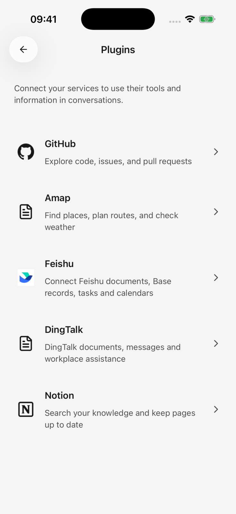

<p align="center">
  
</p>

<h1 align="center">Cherry Studio Mobile</h1>

<p align="center">
  <strong>Your AI workspace on iOS and Android.</strong><br />
  Chat with your favorite models, connect your tools, and turn ideas into images.
</p>

<p align="center">
  <a href="#features">Features</a> ·
  <a href="docs/guides/development.md">Development</a> ·
  <a href="docs/README.md">Documentation</a> ·
  <a href="https://github.com/CherryHQ/cherry-studio-app/issues/new/choose">Feedback</a> ·
  <a href="https://github.com/CherryHQ/cherry-studio">Desktop</a>
</p>

<p align="center">
  
  
  <a href="LICENSE"></a>
</p>

## A Look Inside

<p align="center">
  <a href=".github/images/readme/chat.png"></a>
  <a href=".github/images/readme/paintings.png"></a>
  <a href=".github/images/readme/plugins.png"></a>
</p>

<p align="center"><sub>Conversations · Image creation · Connected tools<br />Real app screenshots captured on iPhone 17 Pro.</sub></p>

## Features

### 💬 Your Models, One Conversation Space

Connect multiple AI providers, manage your models, and choose the right one for each conversation.
Read streaming responses with Markdown formatting and bring images and text attachments into the
conversation, subject to the selected model's capabilities.

### 🍒 Agents That Work Your Way

Create agents with their own instructions, default models, and tools. Keep separate conversations
for different projects, and review tool actions when approval is required.

### 🔌 Connect Your Tools

Extend your agents with plugins and MCP (Model Context Protocol) servers. Search the web and read
pages with configured search services. Connected tools become available according to their setup,
permissions, and each agent's configuration.

### 🎨 Turn Ideas Into Images

Start from a prompt or a visual template, choose an image model, and create something new. Revisit
your drawing history and use existing images as the starting point for another creation.

### 📎 Keep And Share Your Work

Manage attachments and generated files in the file library. Preview documents and export selected
conversation content as Markdown, HTML, or an image, with available formats depending on the
selection.

### 📱 Made For Mobile, Connected To Cherry

Use light and dark themes, native navigation, and the system share sheet. Pair with Cherry Studio
Desktop to import supported provider configurations and models. Conversation history and remote
agent control are outside the current pairing feature.

Model and connected-service availability depends on your configuration. Some providers require an
account or API key and may charge for usage.

## Development

Built with Expo and React Native. Use **Node.js 24** and **pnpm 12.2.1**.

```bash
pnpm install

# Build and install the development client for one platform:
pnpm ios
# or: pnpm android

# Start Metro for an already installed development client:
pnpm dev
```

The app includes custom native modules and requires a development client. See the
[development guide](docs/guides/development.md) for setup and daily development, and
[Local EAS Builds](docs/guides/local-builds.md) for installation packages and app variants.

## Contributing

Help shape Cherry Mobile through code, bug reports, product ideas, and documentation.

- [Report a bug or suggest a feature](https://github.com/CherryHQ/cherry-studio-app/issues/new/choose)
- Read the [Git workflow](docs/guides/git-workflow.md) and [testing guide](docs/guides/testing-and-ci.md)
  before preparing a pull request.
- Explore the [project documentation](docs/README.md) for architecture and development conventions.

## Community

Cherry Mobile is part of [Cherry Studio](https://github.com/CherryHQ/cherry-studio).

[Official website](https://cherry-ai.com) ·
[Discord](https://discord.gg/wez8HtpxqQ) ·
[Telegram](https://t.me/CherryStudioAI)

## License

[GNU Affero General Public License v3.0](LICENSE).
