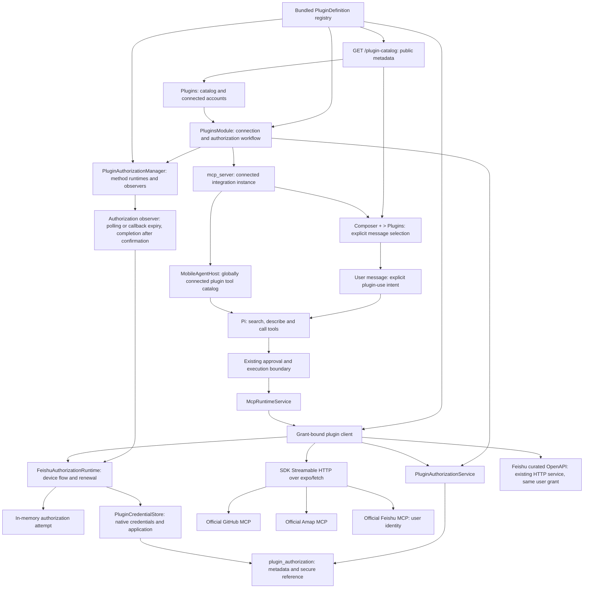

# Built-In MCP Integrations

> Status (2026-09-10): as-built reference for GitHub, Amap and Feishu. All three connect directly
> to official hosted MCP services; no self-hosting is required. GitHub supports publisher-configured
> OAuth App authorization with an in-app system authentication session, account confirmation and
> token renewal. Feishu supports browser-based user authorization with a newly registered or an
> existing application and user-token renewal for nine hosted tools and nineteen curated Base,
> task and calendar operations. Updated authorization and tool
> regression suites have not been run; GitHub and Feishu browser flows still require device and
> live-account acceptance. Canva, Gmail, Yuque, multiple
> accounts and other providers' OAuth remain planned. Proposed designs that are not implemented
> live in [Built-In MCP Roadmap](./built-in-mcp-roadmap.md); availability research is in
> [Plugin Expansion Research](./plugin-expansion-research.md).

## Plugins

The chat drawer's **Plugins** page manages connected accounts and authorization. Connecting a plugin
makes its permitted tools available to every Agent without further configuration. To explicitly
request a plugin for one message, choose **+ > Plugins** in the composer. The add menu closes before
a compact plugin list appears above the input, keeping the keyboard and draft available. The list
has no title, search field, or
close button; selecting an item, tapping outside, or going back dismisses it. Selecting a connected
plugin inserts a named reference at the editor's current selection. Only currently connected,
usable plugins appear; when none are connected, the add menu omits its Plugins entry. Account
connection and reauthorization remain on the Plugins page.
There is no `@` trigger. Removing the reference cancels that message's explicit request, without
disabling the plugin. A successful send clears the references with the draft; a failed send restores
them with the text.

References follow the desktop composer's inline icon and primary-colored name, with no chip fill.
The input's patched native link style replaces its leading object character with a text attachment;
the label remains real text. Text parts retain `pluginReferences` (plugin ID, label, UTF-16 offset)
through pending display and persistence. Message rows reuse the same artwork from this snapshot,
without consulting the current connection or locale. Existing plain-text messages remain readable.
This native input change requires an updated development client.

The composer sends readable names and `pluginReferences` in the user text part. The Host preserves
these references as explicit plugin-use intent in model input and replayed user history, without
changing the stored text. Each turn loads all enabled plugin connections into its frozen tool catalog,
including turns with no references. References never grant or restrict tool access; legacy Agent
plugin bindings do not control availability. Remote MCP servers retain their Agent binding policy.
Plugin references and popover interactions still require device acceptance on both platforms.

| Integration | Implemented authorization | Implemented tools |
| --- | --- | --- |
| GitHub | Publisher-configured OAuth App authorization with account confirmation, or a personal access token; read-only `get_me` validation | `get_me`, `search_repositories`, `search_issues`, `search_pull_requests`, `get_file_contents`, `list_pull_requests`, `issue_read`, `pull_request_read`, `issue_write`, `add_issue_comment`, `create_pull_request` |
| Amap | User-supplied Web Service key; read-only Beijing `maps_weather` validation | `maps_text_search`, `maps_around_search`, `maps_geo`, `maps_regeocode`, `maps_direction_driving`, `maps_direction_walking`, `maps_direction_transit_integrated`, `maps_weather` |
| Feishu | Browser-confirmed user authorization with a new or existing application. Setup checks account identity and discovery of at least one authorized tool without a business-tool call | Nine hosted document/people tools and nineteen curated wiki, Base, task and calendar operations; see [Feishu Business Tools](#feishu-business-tools) |
| WeCom | Confirmation inside WeCom followed by signed CLI token exchange; discovery-only setup | Dynamically discovered official service schemas; see [WeCom Official API](#wecom-official-api) |

### Official Cloud Coverage

GitHub's hosted endpoint is `https://api.githubcopilot.com/mcp/`, authenticated with a Bearer token.
Amap's is `https://mcp.amap.com/mcp?key=...`. Feishu's is `https://mcp.feishu.cn/mcp`, authenticated
with `X-Lark-MCP-UAT` for the authorized user. All use the existing
SDK's Streamable HTTP transport. The Amap key is injected only when sending a request; the SDK
endpoint and saved server identity contain no key. Routing is fixed in backend code and redirects
cannot forward credentials elsewhere. GitHub also receives `X-MCP-Tools` for the admitted subset;
Cherry enforces the allowlist locally for all three services, independently of upstream behavior.
Feishu also receives `X-Lark-MCP-Allowed-Tools`, containing only admitted hosted tool names.
Its curated business operations use the same user grant against fixed `https://open.feishu.cn`
OpenAPI routes through the app's HTTP service, with a Bearer user token and no redirects.

| Former capability | Official replacement | Difference |
| --- | --- | --- |
| GitHub profile, repository search, file reads, PR listing | `get_me`, `search_repositories`, `get_file_contents`, `list_pull_requests` | Upstream schemas and result shapes |
| GitHub issue/PR search | `search_issues`, `search_pull_requests` | Separate tools |
| GitHub issue/PR detail | `issue_read`, `pull_request_read` | Upstream `method` selects the read operation |
| GitHub issue creation | `issue_write` | Supports creation and updates; follows tool approval |
| GitHub comments and PR creation | `add_issue_comment`, `create_pull_request` | Existing-branch PR workflow retained |
| Amap place and nearby search | `maps_text_search`, `maps_around_search` | Former pagination inputs are not guaranteed |
| Amap address/coordinate conversion | `maps_geo`, `maps_regeocode` | Upstream schemas and result shapes |
| Amap driving, walking and transit | `maps_direction_driving`, `maps_direction_walking`, `maps_direction_transit_integrated` | Longitude-first GCJ-02 coordinates |
| Amap weather | `maps_weather` | Forecast-oriented; no promise of the former live/forecast switch |
| Amap administrative districts | None in the documented cloud catalog | Removed; no local REST fallback |

This covers GitHub's previous workflows and eight of Amap's nine capability categories. The official
catalogs own business behavior; Cherry does not translate old calls or duplicate their schemas.
Newly published GitHub and Amap tools require an explicit code admission decision. A missing or incompatible
tool is unavailable, not an invitation to fall back to the deleted local implementation.

The plugin detail page explains that connected plugins are available globally and composer selection
expresses an explicit request for one message.

The initial database schema includes desktop connections, plugin authorizations, and MCP server
references. Plugin identifiers and authorization methods are open, nonempty strings; bundled
definitions own availability and credential compatibility. Platform registration does not change SQL.

Sources: [GitHub remote service](https://github.com/github/github-mcp-server/blob/main/docs/remote-server.md),
[GitHub tools](https://github.com/github/github-mcp-server),
[Amap hosted setup](https://lbs.amap.com/api/mcp-server/gettingstarted),
[Amap capabilities](https://lbs.amap.com/api/mcp-server/summary). Amap's official
`@amap/amap-maps-mcp-server@0.0.8` distribution corroborates tool names and forecast output; it is
source evidence, not a bundled dependency or proof of live remote schema parity.

### Grants And Connections

The `plugin_authorization` table stores plugin ID, authorization method, account label, an opaque
`credential` reference and timestamps. `PluginCredentialStore`, owned by the authorization manager,
keeps plugin secrets in `expo-secure-store` with `WHEN_UNLOCKED_THIS_DEVICE_ONLY` and no biometric
prompt. Credentials are local to this installation and do not participate in sync. This policy is
specific to plugins; provider API keys and remote MCP headers are outside this change.
Backend types distinguish `PluginSecretReference` in the database schema from `PluginCredential`
and resolved `PluginGrant` in `builtInMcp/authorization`. The database service accepts
`credentialReference`; the native store accepts secret values as `credential`. The SQL column is
still named `credential`, so this distinction changes no persisted format.
Each authorization method owns and validates its versioned object before native persistence:
GitHub personal tokens store `{ version: 1, token }`; GitHub OAuth stores application identity,
account facts and tokens in its versioned credential. Amap stores `{ version: 1, key }`, and Feishu
user authorization stores `{ version: 1, application, tokens }`. Token values, scope and expiration
metadata belong inside that object; adding an authorization field does not add a database column.

Reusable application information and completed grants occupy separate native items. Browser
challenges and uncommitted user credentials stay in the method runtime's memory. Leaving the page
keeps the attempt within the same process; restarting the app requires starting authorization again.

Completion saves the native credential first, then commits its reference and MCP connection in
SQLite. Failure is reported for the user to retry the flow. Replacement and disconnect delete known
obsolete native items on a best-effort basis; SQLite determines which authorization is usable.
There is no legacy credential import, startup migration, orphan scan or persistence-retry journal.

`PluginAuthorizationService` commits each grant and its MCP reference together. Updating
authorization preserves the server UUID but allocates a new grant identity; disconnecting disables
existing Agent bindings, deletes the server and grant, and invalidates active calls. Reconnecting
after disconnect restores global availability for subsequent turns. Credentials stay out of frontend
query caches and tool arguments.

Catalog metadata comes from `GET /plugin-catalog`; connection metadata comes from
`GET /plugin-connections` on the Data API. The `PluginsModule` owns connect/disconnect and the
interactive authorization surface: observe, check, begin, receive callback, account review/confirm,
use an existing application, cancel and reset application. It also exposes local connection-status
notifications and the result of optional remote revocation. Authorization actions select both a
plugin and an authorization method. Shared plugin entities live under `shared/data/types`; the MCP runtime's
connection configuration remains backend-private.

`createBuiltInMcpClient` resolves a registered plugin and checks its stored authorization method.
`createOfficialMcpClient` supplies the shared HTTP transport and rechecks the referenced grant
before every network request, propagates cancellation, and does not replay writes. There is no
transport-level `authProvider`, so a `401` cannot trigger a resend. HTTP errors expose only safe
diagnostics; ambiguous submitted writes tell the caller to check the service before retrying. Input
validation and result-size limits remain in the existing MCP runtime. Its frozen descriptors carry
the bundled read/write policy. Unclassified write failures, including SDK response-body failures
and the execution deadline, return non-retryable `mcp_tool_write_outcome_unknown`. This is conservative:
it does not assert transmission when the deadline expires while authorization is still pending.
Already classified failures retain their category when they reach the adapter before cancellation.
GitHub token permissions and
Amap quota/access restrictions remain upstream authority. No device-location grant is requested.

### GitHub Browser Authorization

The publisher-configured `github_user` method uses an OAuth App and a system authentication session
with S256 PKCE. It requests `repo offline_access` for the admitted repository tools and renewable
user tokens; an OAuth response without `repo` is rejected.
The backend runtime validates the exact redirect, state and expiry and consumes the code once.
The generic callback route only forwards the original URL and removes it from navigation; no token
exchange or persistence belongs to the route. A cold start returns to the connection screen to begin
again. The method is hidden when publisher configuration is incomplete; `personal_token` remains.

`/user` supplies the stable numeric account ID. The runtime remains in `review` until the user
confirms the account, then the observer runs read-only MCP validation and commits through the shared
store. No installation query, repository selection or minimum repository count is required.
Same-account reauthorization preserves the server and Agent settings. A different account ID, an
incomparable method, or a changed expected grant requires explicit disconnect before replacement.

A completed native credential contains application identity, account facts, complete rotated tokens,
and confirmed rejection. Pending tokens are memory-only. Renewal shares results
and uses owner cancellation; an uncertain refresh or failed native write is not automatically
retried in the same runtime. Query reads project local status and never refresh or call GitHub.
Resource/network/quota errors remain distinct from confirmed token rejection. A late MCP 401 must
match the current grant and sent token before marking the credential rejected.

Disconnect captures the current token's revocation closure in memory, removes local authorization
and bindings first, then attempts remote revocation with a five-second deadline. Failure leaves the
local connection removed and exposes an unconfirmed result with the authorization settings link.
See [GitHub Plugin Authorization](../../guides/github-plugin-authorization.md) for publisher setup
and the still-required live-account/device acceptance.

### Feishu Browser Authorization

`McpRuntimeService` owns `PluginAuthorizationManager`, which creates and stops one runtime and
observer per registered interactive method. Feishu supplies `FeishuAuthorizationRuntime`. It performs one step per
call and keeps no timers. A backend authorization observer schedules those steps: while at least one
screen observes, it polls at the server's interval (increased on `slow_down`, bounded by the
original expiry), completes an approved attempt once, and pushes the state, progress and outcome to
the screen. Detaching stops scheduling only; the attempt stays in memory for the next visit
within the same process. The connection screen observes while it is focused and the app is active, and asks
for one immediate check when the browser closes. No Cherry callback is promised: users return
manually after each official confirmation, and browser close is a check, not a success or denial
guess.

The primary application entry uses the official `PersonalAgent` flow to open the Feishu page.
That page offers eligible custom applications owned or administered by the signed-in user; it hides
the existing-application selector when its filtered list is empty or the URL requests creation only.
Cherry saves the returned application credentials before the separate user grant. The secondary
entry explicitly offers manual entry of an existing application's ID and secret, validated by the
method's field rules. Both entries authorize the personal account. The application is kept across cancellation,
failed user authorization and disconnect, so a later authorization never registers another
application in Feishu. An explicit, confirmed recovery action forgets the saved application
without dropping a live grant. The official page may retain CLI wording and require organization
approval; Cherry sends no invented CLI version or third-party brand alias. Only domestic Feishu
accounts are supported; cross-brand Lark handoff is rejected.

The requested scopes are generated from the admitted tool manifest plus `offline_access`.
Chat, media and board scopes remain dependencies of document tools, without standalone messaging
or file-transfer operations. Discovery intersects each tool's declared scopes with the actual grant;
partial grants retain their permitted tools. Renewal capability is proven by an issued refresh token
rather than an echoed `offline_access` scope. Setup checks the account identity and at least one
admitted tool, so calendar-only access does not depend on document permissions or hosted discovery.
Existing grants keep their permitted capabilities; reauthorize the saved application only to add
permissions. Refresh does not expand consent. The plugin screen checks credential expiry and whether
any tools are permitted without making a network request. No database or credential-format migration
is needed.

One method queue serializes exchanges, renewal, persistence and grant commits. Explicit
authorization cancellation invalidates the attempt before late work can commit. Ordinary tool-call
cancellation only releases that caller's wait: shared renewal uses the runtime and grant lifetime,
continues for other callers, and saves the returned token object even when every caller has left.
Concurrent callers share the same pending result, including failures. Disconnect, successful grant
replacement and host disposal invalidate the old renewal owner.

Renewal replaces one native item under a stable reference after checking the grant ID
in the manager-owned storage queue. It requires no second SQLite write and
cannot recreate a deleted row or overwrite a replacement. The grant ID remains stable during
ordinary rotation; the HTTP transport rechecks that ID and authorization method after credential
resolution and before sending. Updating a token therefore does not itself invalidate the connection.
A failed save is reported and requires the user to authorize again; no issued result is retained for
an automatic persistence retry. Disconnect removes local authorization and disables Agent bindings;
it keeps the application and does not revoke consent at Feishu.

Live iOS/Android login, organization approval, process interruption and actual token renewal still
need user-authorized acceptance. The public registration mechanism's support for Cherry as a
third-party mobile client is not established by source inspection alone.

Protocol references: [official registration](https://github.com/larksuite/cli/blob/9aaedb981b036ca94bd8ec9c630adf0ead9b6d1c/internal/auth/app_registration.go),
[device authorization](https://github.com/larksuite/cli/blob/9aaedb981b036ca94bd8ec9c630adf0ead9b6d1c/internal/auth/device_flow.go),
[user-token renewal](https://github.com/larksuite/cli/blob/9aaedb981b036ca94bd8ec9c630adf0ead9b6d1c/internal/auth/uat_client.go).

The `development-simulator` EAS profile builds an ARM64 development client: the currently pinned
Anydoc native dependency provides only an ARM64 simulator slice. It is a simulator `.app` archive,
not an installable physical-device IPA.

### Feishu Business Tools

| Domain | Admitted tools | Boundary |
| --- | --- | --- |
| Hosted documents and people | `fetch-doc`, `list-docs`, `get-comments`, `create-doc`, `update-doc`, `add-comments`, `search-doc`, `search-user`, `get-user` | Official names and schemas; document search covers doc/docx |
| Wiki and Base | `wiki_get_node`, `base_list_tables`, `base_list_fields`, `base_search_records`, `base_create_record`, `base_update_record` | Resolve `/wiki/` links to `obj_token`; inspect fields, then query or write existing tables |
| Tasks | `task_list`, `task_get`, `task_create`, `task_update`, `task_add_members` | List tasks assigned to the user; explicit member open IDs; complete/reopen the whole task |
| Calendars | `calendar_list`, `calendar_get_primary`, `calendar_list_events`, `calendar_get_event`, `calendar_create_event`, `calendar_update_event`, `calendar_get_freebusy`, `calendar_add_attendees` | Explicit calendar/event IDs; people invitations only; recurring instances use their own IDs |

`plugins/feishu/feishuTools.ts` owns the combined policy and scope union. Each domain declaration
owns its description, input schema, read/write classification, required scopes and fixed request
mapping. `createFeishuClient` filters discovery by the current grant and routes exact tool names.
The hosted client initializes lazily. Its complete paginated discovery has a separate five-second
deadline; failure preserves permitted local tools and reports a safe discovery warning. The combined
tool catalog is returned as one page. `feishuOpenApi` owns HTTP dispatch, safe error mapping, grant
rechecks and cancellation. The shared plugin client also exposes optional discovery warnings; no
in-process MCP server or general URL/request tool is introduced. Existing approval and result
handling own both routes, and client close cancels pending local calls.

Each turn retains partial discovery warnings alongside its permitted tools. The Host supplies these
status records to the model even if no MCP tools loaded, so it can explain unavailable capabilities
without pretending the plugin was never connected. Unsupported individual parameter schemas are
omitted with a warning rather than discarding the whole server. Tool search stays local to the frozen
turn catalog; Chinese character-pair matching and Chinese domain descriptions support queries such
as `飞书日历`. Search never expands authorization or bypasses invocation approval.

Business API lists return one bounded page and preserve continuation tokens. Base filtering/sorting overrides
the supplied view, so descriptions warn that it searches the whole table. Task timestamps are
milliseconds; calendar timestamps are seconds, all-day end dates are exclusive, event queries use
windows shorter than 40 days, and free/busy queries require explicit offsets and at most 90 days.
Task patches distinguish omitted fields from explicit date clearing. Event time patches require
both start and end. Create operations expose the provider's optional idempotency key; there is no
automatic retry, including after a rejected token or an uncertain write result.

Requests are capped at 256 KiB and OpenAPI responses at 120 KiB to leave space inside the runtime's
256 KiB JSON result limit. Request fewer fields, a smaller page or a shorter calendar window when
needed. Attachment transfer, including the official `fetch-file` tool, is outside the Feishu
plugin's product scope. Schema editing, batch writes, deletion, messaging and room booking are
outside this curated slice. User-owned live
authorization and business-flow acceptance remain pending; the regression suites were added or
updated without running them.

Protocol references: [hosted tools](https://open.feishu.cn/document/mcp_open_tools/developers-call-remote-mcp-server),
[Base search](https://open.feishu.cn/document/uAjLw4CM/ukTMukTMukTM/reference/bitable-v1/app-table-record/search),
[task updates](https://open.feishu.cn/document/uAjLw4CM/ukTMukTMukTM/task-v2/task/patch),
[calendar instances](https://open.feishu.cn/document/uAjLw4CM/ukTMukTMukTM/reference/calendar-v4/calendar-event/instance_view),
[common error codes](https://open.feishu.cn/document/ukTMukTMukTM/ugjM14COyUjL4ITN).

## WeCom Official API

Cherry implements the current official CLI gateway protocol in native TypeScript. The plugin owns
bot authorization, native credential storage, schema discovery, request envelopes, file handling,
long-task polling and the AI workflow guide. Official services own business definitions and
execution. No CLI executable or app-hosted MCP server is required.

The single `wecom_bot` method copies an official confirmation link for opening inside WeCom, polls
for bot identity and secret, and signs `get_cli_config` to obtain a bearer token. Setup validates
authorized service discovery without executing a business operation.

Business traffic stays under `https://qyapi.weixin.qq.com/cli`, using the shared non-streaming HTTP
client. `/service/discovery` supplies the service catalog and named schemas, with a 60-second cache.
Tool names follow `wecom_<service>__<resource>__<method>`, including deeper resource paths. The client
resolves references, hides internal fields and invokes only discovered routes. Reviewed read paths
retain read policy; every new name requires the existing write approval policy. Unsupported
interfaces or unavailable services leave safe warnings alongside usable tools. An upstream hint
cannot grant read approval to an unknown tool.

Every JSON request uses POST and the official stringified `payload` envelope. Responses validate
both gateway and nested business errors. Token rejection `853004` renews the token; only a rejected
read can replay once. Failed writes require explicit retry, and uncertain outcomes must be checked
in WeCom first. Long tasks poll by task ID, using `/task/query` or an empty original-endpoint request
with `X-Long-Poll-TaskId`; polling does not resubmit original write content.

Official file-upload directives resolve attachment/file-tool IDs or local export/download paths, upload media
or create multipart fields. Uploads have a 100 MiB file/multipart cap. Binary/range downloads have a
64 MiB cap; file-save directives create unique files under the app cache and return their actual
paths. Large JSON results are saved intact, with guidance to request smaller pages for chat.
Branch-dependent file directives are treated as unsupported definitions. Native file transfer
still needs device acceptance.

The workflow guide covers current document and table types, identity resolution, task/calendar
semantics, mail/message targets, pagination and asynchronous completion. Message-session discovery
does not imply access to unread messages or all chat history. Data access and administrator
requirements remain controlled by WeCom; discovery is not proof of permission for every resource.

Protocol source: [official CLI 1.2.1 at 1cd90a5](https://github.com/WecomTeam/wecom-cli/tree/1cd90a5337ce11ffbcf14c5ad2e85e6ee97c8b08).
See [the integration reference](../../../src/backend/services/builtInMcp/README.md#wecom-official-api)
for module ownership, limits and source links. Regression suites were updated but not run; the new
authorization and business transport still require live-account acceptance.

## Extensible Plugin Definitions

`PluginDefinition` is the single bundled extension contract. `pluginRegistry.ts` registers bundled
definitions from `plugins/`. Each definition owns:

- A stable `catalog.id`, links, an optional icon name and the saved MCP
  server name. Display copy is not in the definition: every user-facing string for a plugin lives
  in the locale files under `plugins.catalog.<id>`, alongside the rest of the application's copy.
- An ordered `authMethods` collection. Each method has its own stable ID, form fields or interactive
  stages, credential codec or runtime factory, and request-authorization factory. The first method
  is the default; the connection page offers every other registered method.
- `createClient`, which receives the credential resolver, grant recheck, method-owned request
  authorization, cancellation signal and admitted tool policy.
- Reviewed tool names classified as `read` or `write`, plus a read-only connection validation rule.
- Optional `acceptsDiscoveredTool` admission for additional upstream names, always classified as
  `write`. The provider client must restrict invocation to its actual authorized discovery.

The [module directory map](../../../src/backend/services/builtInMcp/README.md#file-ownership)
defines implementation placement: common authorization lives in `authorization/`, client and
connection validation in `transport/`, and provider-specific code in `plugins/github/` and
`plugins/feishu/`.

The database stores open strings for `pluginId` and `authMethod`. SQL checks only that they are
nonempty; it still preserves foreign keys, remote/built-in source constraints and the single
connection per plugin index. The serialized MCP schema validates identifier syntax rather than
listing provider names. Runtime availability is a separate decision: only registered definitions
can create clients or admit tools, and a stored grant must match one of that definition's auth
methods. Unknown definitions are retained in storage and shown as unavailable; their connections
can be disconnected. They cannot execute, even when an old Agent binding still exists.

`GET /plugin-catalog` exposes a detached, JSON-only projection of the same definitions. It includes
no credential, auth implementation or client factory. The list, detail and connection pages derive
from that projection and translate its identifiers. Credential fields declare secret display,
maximum length and an optional pattern; `createPluginCredentialsSchema` derives strict validation
for both the form and backend workflow. Credential forms remain generic. Unknown icon names use a
generic document icon.

Interactive methods are part of the same registry. The manager looks up a method's runtime
factory; workflows and screens contain no provider-name branches. The shared state exposes a
provider-owned stage string, and `InteractiveConnect` renders the declared stages and localized
copy. Existing-application entry is an optional method capability. Manual forms use the selected
method's field rules. Generic action copy lives under `plugins.authorization`; plugin and method
copy lives only under `plugins.catalog.<id>`, with method copy under `authMethods.<methodId>`.

To add another hosted MCP plugin or authorization method:

1. Add a definition under `src/backend/services/builtInMcp/plugins/`, with its links, methods,
   reviewed tools, read-only setup check and locale copy. Methods declare either credential fields
   and an encoder or interactive stages and a runtime factory. Keep a provider's private clients,
   credential schemas, authorization runtime and tests in its own directory once it spans files.
2. Reuse `createOfficialMcpClient` with a fixed official endpoint. Each method provides its own
   credential injection. A renewable method implements `resolveCredential` and owns its renewal
   lifetime and persistence through the scoped authorization store.
3. Register the plugin once in `pluginRegistry.ts`, or add a method to an existing definition.
   The catalog, method selector, persistence and runtime manager consume it without provider
   switches. Interactive methods explicitly declare browser polling or callback capability. The
   generic screen handles callback review and confirmation; native SDK interactions remain future work.
4. Cover the authorization, validation and tool boundary. Run cloud/device acceptance only when
   explicitly authorized.

Keep plugin IDs and auth-method identifiers stable across releases. Version credential objects
inside their owning methods and migrate old formats explicitly. Shared storage only validates the
JSON object boundary. Display-name or tool-catalog edits do not justify changing a durable ID.

This is bundled code registration, not downloaded executable plugins. The `createClient` boundary
can later host an in-process adapter without adding provider switches to storage or screens.

## Scope

Cherry Mobile plans six integrations in its Plugins directory. A user connects an account and uses
its tools through ordinary conversation with any Agent. Composer references explicitly request a
plugin for a message without changing availability. The application owns authorization and tool
orchestration on the device; official MCP services execute their business
tools remotely. Expiring GitHub and Feishu user grants renew on demand; other OAuth providers remain
later slices. No Cherry-operated authorization proxy, command-line program, local HTTP listener,
or desktop process is required by this design.

GitHub, Amap and Feishu document tools use official remote MCP services; Canva and Gmail are planned
to use that route after their access and authorization prerequisites are met. Feishu's curated Base,
task and calendar operations use in-app OpenAPI adapters; Yuque's direct-API design remains planned. All enter the existing MCP
discovery, binding, approval, and result pipeline. Canva is an explicit upstream MCP dependency, not
a claim that its Connect REST API supports a secretless mobile client.

| Region | Integration ID | Initial useful tools | Execution and authorization |
| --- | --- | --- | --- |
| International | `github` | Search repositories; read files; list/read issues and pull requests; create/update issues and comments | Official hosted MCP with publisher-configured OAuth App authorization or a personal token. [Remote service](https://github.com/github/github-mcp-server/blob/main/docs/remote-server.md) |
| International | `canva` | Search/read designs; generate a candidate and create a design; export a design | Planned remote MCP connector, pending callback approval and user OAuth. Preserve upstream names such as `search-designs`, `get-design`, `generate-design`, `create-design-from-candidate`, and `export-design`. [Tool catalog](https://www.canva.dev/docs/mcp/tools/) |
| International | `gmail` | Search/read threads; create drafts; modify labels | Planned official hosted MCP after Developer Preview access and mobile OAuth setup. Sending drafts is not in the current official MCP catalog. [Official setup](https://developers.google.com/workspace/gmail/api/guides/configure-mcp-server) |
| China | `amap` | Search places; search nearby; geocode; plan a route; weather forecasts | Official hosted MCP with a user-supplied Web Service key. [Getting started](https://lbs.amap.com/api/mcp-server/gettingstarted) |
| China | `yuque` | Search/read documents; list knowledge books; create/update documents | Local functions and OpenAPI with a user-supplied personal or space token. [Official API client](https://github.com/yuque/yuque-open-cli/blob/main/README.zh-CN.md) |
| China | `feishu` | Search/read/edit documents and comments; find people; query/write Base records; manage tasks, calendar events and invitations | Official developer MCP plus curated in-app OpenAPI with shared browser user authorization. Live acceptance remains pending. [Official developer MCP](https://open.feishu.cn/document/mcp_open_tools/developers-call-remote-mcp-server) |

Future local integrations may use Cherry-owned names such as `read_document`; remote integrations
preserve official names. Full API coverage, Feishu messaging, Canva
editing transactions, and permanent deletion operations are later capability slices. All six
platforms remain in the plan regardless of delivery order.

## Architecture

The [current tool architecture](./agent-tools-and-resources.md) remains authoritative for shipped
behavior. Pi owns the only model/tool loop, the Host freezes executable tools per turn, and MCP
tools already use `tool_search`, `tool_describe`, and `tool_call`.

There are three durable facts with different owners:

1. A bundled definition describes an integration, its endpoint and admitted tools. Definitions ship in
   code and are not copied into a database catalog.
2. An authorization records a particular account/grant and its credentials and permitted scopes.
3. An enabled MCP server instance connects a definition to an authorization and makes its permitted
   tools available globally. Plugin availability does not require Agent bindings or message references.

Connecting an account enables the plugin for all Agents. Selecting an integration in the composer
expresses the user's explicit intent for that message; all connected plugins remain available.
The Host ignores legacy Agent plugin bindings. Remote servers still require Agent bindings, and
message references cannot enable disconnected plugins or bypass remote server policy.

Every plugin tool keeps the existing identity `{ source: 'mcp', serverId, rawToolName }`, so it
inherits current aliasing, discovery, approval, audit and history behavior. The `builtin`
ToolRef variant remains reserved for the device/system capability catalog. The Host freezes the
tool snapshot with its callback per turn; execution rechecks the grant before touching the
platform. Changing accounts, reconnecting a different grant, disconnecting, or reducing permissions
invalidates the old connection. Ordinary token renewal for the same grant does not. Settings edits
apply to the next turn; a revoked grant stops further calls in the current turn. An already
submitted remote operation cannot be rolled back merely by cancelling locally.

All integrations retain the current base MCP `ask` policy and existing Agent approval-mode rules.
Provider annotations are descriptive hints, not authorization. User-selected automatic approval
can reduce routine prompts through the current mechanism; connecting an account does not itself
grant automatic approval. Hosted tools normally use a reviewed subset of discovered upstream names
and schemas. WeCom explicitly admits additional discovered names with write policy and binds their
invocation to the authorized service. Feishu's local declarations provide the reviewed OpenAPI
operations. A remote annotation alone cannot admit a tool or change its approval policy.
