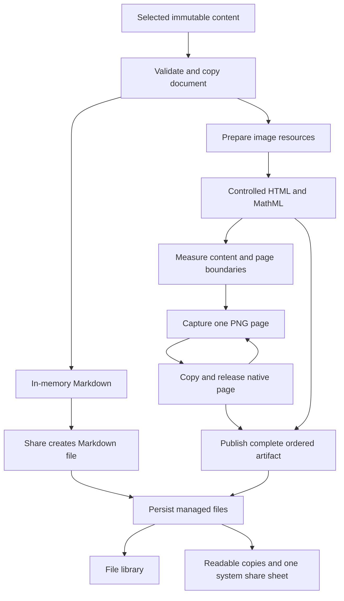

# Document Export

Document export is an application capability. Chat supplies a document adapter; conversion has no
Agent, conversation, live message-list or navigation dependency. The current paged capture and
multi-file delivery require iOS/Android device acceptance. Earlier simulator evidence does not
validate this implementation.

## Ownership

| Owner | Responsibility |
| --- | --- |
| `shared/contracts/documentExport.ts` | Documents, targets, ordered artifacts, sessions and capture delivery |
| `backend/services/documentExport` | Validation, resources, conversion, temporary files and explicit persistence |
| `DocumentExportRuntime` | Foreground admission, live/closing sessions and host teardown |
| `bootstrap/composition/createBackend.ts` | Managed-file dependencies bound to the originating database |
| `frontend/appShell/fileExport` | Watermark configuration, finalized-file delivery, system availability and cancellation checks |
| `frontend/appShell/documentExport` | Transient handoff; routes contain only the request ID |
| `frontend/features/documentExport` | Format/layout choice, capture and user-triggered delivery |
| `frontend/components/ArtifactPreview` | Actual-image reading shared with the file viewer |
| `frontend/features/chat/share` | Selection, selected-history reads and thinking inclusion policy |
| `frontend/features/library` | Existing file stream with a Sharing provenance filter |

Follow [Code Organization](./code-organization.md), [Runtime Ownership](./runtime-ownership.md) and
[workflow contracts](../../src/shared/contracts/README.md). `Backend.documentExport` is the only
frontend workflow boundary. Export is not an Agent or MCP tool.

## Pipeline



The target switch is explicit. Programmatic Markdown/HTML conversion does not require a mounted
page. Image conversion receives a capture callback; backend code never imports a React component
or owns a native view reference.

## Document And Session Contract

A document contains an optional title, ordered sections, headings/metadata and text, Markdown,
image, attachment, detail or reference blocks. Optional bubble/message hints express source-owned
hierarchy without exposing chat models. Assets refer to managed file IDs or eligible remote URLs.
Markdown image references are discovered through parsed tokens so code examples never download
resources. `{ kind: 'markdown', source, title? }` normalizes to the same model.

Input is copied and deeply frozen. Successful image reads become reusable byte snapshots; failed
reads can retry. `session.document` and `session.markdown` are available without files or asset reads.

```ts
const session = backend.documentExport.createSession({ kind: 'markdown', source: '# Notes' });
try {
  const previewText = session.markdown;
  const artifact = await session.render({ format: 'markdown' });
  const files = await session.save(artifact); // One file here; images may return multiple pages.
} finally {
  await session.dispose();
}
```

`render` accepts an abort signal and semantic progress, including the current image ordinal and
total. HTML/image targets receive validated logical width, resolved typography and semantic colors.
The page freezes typography/time at opening. Images always use a 360-logical-pixel width; HTML
retains its window-derived width. Theme changes regenerate the preview except during delivery.
Image output includes numbered messages, theme surfaces, Cherry branding and the local
`YYYY.MM.DD HH:mm` timestamp inside the captured document.

Markdown/HTML artifacts hold one file and source text. Image artifacts hold a layout (`pages` or
`single`) and ordered `pages`, each containing its PNG descriptor, width and height. Artifacts,
page collections, file descriptors and image/formula issues are frozen. They do not retain source
HTML as a substitute image preview.

A session admits one operation at a time. Capture delivers each page through awaited `onPage`;
the surface releases the native PNG only after the backend copy settles. Delivery must be ordered
and match the declared total. Only a complete batch replaces the current artifact. Failure cleans
the incomplete directory and retains the previous artifact. `save` accepts only the current artifact.
Repeated Markdown rendering reuses the current file when available and its complete text, including
the signature, matches.

HTML and image presentation share an optional resolved `watermark`. The application follows the
global Share watermark setting, enabled by default. Explicit `cherry` or `none` options override
that preference; `none` omits the brand footer from every preview and output format.
The Cherry variant contains a `signature` with resolved background/text colors, the embedded Cherry
logo, brand name and frozen timestamp. The frontend supplies the shared white
footer with black text used by painting and file image exports. The renderer copies and validates
the presentation, escapes its text and includes the signature after the content inside `main`.
The image-only `imageFrame` uses the document background and supplies a localized label. Image content
spans the output width with ordinary text padding, without a contrasting outer frame. Image-to-HTML fallbacks
retain the watermark. Markdown uses the same resolved watermark's brand name and timestamp in a
separated text footer; preview and saved text share its formatter.
`session.markdown` remains the unbranded source. The signature ends the document and is not repeated
on every PNG page. PNG pages have no page numbers or reserved ordinal-footer space.

## Content Behavior

| Content | Markdown | HTML and image |
| --- | --- | --- |
| Plain user text | Escaped formatting markers and preserved line breaks | Literal text; HTML bubbles or numbered image sections |
| Prose, lists, tables, code | Authored Markdown | `markdown-it`; code wraps and tables fit width |
| Math | Authored source | KaTeX MathML with bounded expansion; unsupported formulas retain source |
| Managed images | Alt/name placeholder | Validated embedded PNG/JPEG or a placeholder |
| Remote images | Eligible external URL | Fetch without credentials, then embed or use a placeholder |
| Attachments | Name/type and eligible link | Name/type and eligible link; documents are not rasterized |
| Included process/details | Nested collapsed `<details>` retaining content | HTML starts collapsed; image capture expands included details |
| References | Numbered links | Numbered links and readable URLs |

HTML embeds displayed resources and inline CSS. Raw authored HTML is escaped. Links admit HTTP,
HTTPS and mailto without credentials. CSP disables scripts, remote subresources and forms. HTML
preview disables JavaScript. The capture WebView accepts only its injected protocol, blocks
navigation, file access, cookies and new windows, and waits for assets/fonts/layout before capture.
Image preview contains actual PNGs, so it has no interactive links or disclosures.

Chat HTML retains the native bubble/message hierarchy, accessibility typography and existing
surface/code tokens. The source adapter supplies two snapshots when thinking exists: omitted by
default and included by the switch. Included content covers visible reasoning, intermediate prose
and readable tool names, never raw payloads, credentials or diagnostics. The image capture expands
those supplied details so their content is readable without an interactive disclosure.

## Image Layout And Capture

The renderer remains `markdown-it` → `react-native-webview` → `react-native-view-shot` 5.1.0.
View Shot documents WebView support with a non-collapsible Android wrapper
([upstream](https://github.com/gre/react-native-view-shot#interoperability-table)). Browser alternatives
such as [html-to-image](https://github.com/bubkoo/html-to-image) also have large-output scaling and
canvas/data-URL limits; swapping libraries does not establish unlimited image capacity.

Default image layout is **paged PNG at fixed 3x density**. Content stays in one image until it reaches
the capture budget, shared with HTML image conversion's 8192-pixel edge limit. After reserving
16 logical pixels of top spacing, each content slice holds up to 2714 logical pixels. At the page's
fixed width this yields 1080-pixel-wide images no taller than 8190 pixels, with no page-number footer.
This is an application capture budget, not a detected device maximum. Content
length adds pages rather than lowering resolution or truncating the selection.

Pagination fills each image to that limit and uses painted ranges to move a cut back only when
needed to avoid splitting content. Message and paragraph boundaries do not trigger early cuts. Headings stay
with the following line; normal table rows remain intact. Oversized rows can continue between
painted lines. Embedded images are contained within the page height. An indivisible object that
cannot fit causes conversion failure instead of silent clipping. Table continuation headers are
not repeated by the current slicing implementation.

Only the current slice enters the native screenshot viewport. Original layout coordinates stay
fixed while the clipping window advances. CSS zoom maps logical layout into the chosen output
pixels independent of screen density. Native layout and browser frames settle before each capture.
The frontend checks the PNG's 24-byte header and dimensions, not image sharpness. The screenshot
is copied unchanged and released before the next one; paged capture allocates no full-document
output bitmap and runs no second image encoder.

The layout menu retains **single long image**. This mode measures its capture container and tiles
both axes at 3x density so each native WebView snapshot fits within the available viewport. Tiles
preserve the full document's layout coordinates; a viewport change cancels capture and requires an
explicit retry. Skia composes the tiles and encodes one lossless PNG on a dedicated Worklets worker.
File writes yield between bounded chunks. Cancellation waits for worker completion before releasing
native pixels and scratch files. The final stitched bitmap still has no application output-height/
pixel cap, is not streamed and scales native allocation with document length. It cannot guarantee
arbitrary dimensions on the device or in receiving applications. Native acceptance must inspect
the actual PNG for blank regions and tile seams.

## Validation And Resource Boundaries

| Resource | Rule |
| --- | --- |
| Text | 500,000 UTF-16 code units across admitted values |
| Sections | 128 selected sections |
| Input structure | 10,000 visited values; depth 24 before recursive schema parsing |
| Image source count/bytes/pixels/dimensions | No application cap; dimensions must be positive |
| Supported images | Still PNG/JPEG; unsupported or animated formats use placeholders |
| Repeated embedded image bytes | No application cap |
| Remote read | 15 seconds, no redirects, cancellable stream |
| HTML width / type | 280–800 logical pixels / 12–40 font size and 12–56 line height |
| Paged capture | 8192-pixel edge budget; 2714 logical content height plus 16 top spacing at 3x |
| Single capture | Tiles fit measured native viewport in both axes at 3x; final PNG has no application height/pixel cap |
| Capture wait | 60 seconds per page; physical lease includes native capture and file copy |
| Sessions | Four live/closing sessions, one interactive request |

The native lease prevents a closing capture from overlapping a replacement. Cancellation hides
the surface immediately; capture completion waits for in-flight native work and page copying before
backend temporary cleanup. Late results never publish. Background/inactive transitions pause work
and require an explicit retry; they do not start a fallback conversion. Ordinary image failure
prepares HTML; failed HTML conversion retains the complete Markdown preview and reports the actual
resulting format.

## Actual Image Reading

`ArtifactImagePages` displays actual PNG files in the export page and document-export file viewer.
Pages within the viewer's original-pixel budget decode at original resolution; larger pages use
display resolution. Pages fit reading width without initial pixel upscaling,
scroll vertically and support pinch/pan/double-tap zoom. The list pauses scrolling during zoom.
Known dimensions select the viewing path; the file viewer reads only the PNG header before loading.

Single images above the viewer's original-decode budget use a viewport-sized WebView displaying
the actual local PNG URL, with file read access limited to that PNG. Controlled injected code fits
the browser's image document to reading width and reports decode failures; navigation is blocked.
Loading the file URL also uses the native iOS read-access API, which inline HTML does not. This
prevents sending a giant PNG through a full-height native Image drawable; it is not
a region decoder, and browser downsampling/decoding limits remain. It does not guarantee full-detail
viewing of arbitrarily large files.

This boundary matters because a reported Android `ExpoImageView` / `RecordingCanvas` failure tried
to draw a 478,668,800-byte bitmap. Native drawing errors are outside image-loader callbacks.
[Android's drawing implementation](https://android.googlesource.com/platform/frameworks/base/+/master/graphics/java/android/graphics/RecordingCanvas.java)
checks bitmap limits. Paged output avoids that whole-output allocation by design, while embedded
source image decoding remains device-dependent.

## Persistence And System Delivery

`DocumentExportRuntime` is a Gate service depending on `DbService`. Its host-bound dependencies
prevent late work from switching databases. Teardown closes admission, cancels work and waits for
all sessions to dispose. Session scratch lives under the OS cache and is removed on replacement or
exit. A handoff has a 30-second route deadline; missing requests after process death are unavailable.

Share persists files sequentially into the existing managed store with `provenance: 'document-export'`.
Multi-page filenames use sortable ordinal suffixes. Already committed pages survive later failure
or cancellation and are reused on retry of that artifact. A new render/session may create new files.
Committed files remain in the library's Images and Sharing filters and are deleted only through
ordinary file deletion. No new table, database column or permanent export directory is added.
Watermark options affect rendered bytes without adding file metadata. Existing document exports,
including those generated with `none`, are shared unchanged without another watermark pass.

`appShell/fileExport.shareFiles` checks system availability before invoking the page's
materialize/save factory, checks cancellation and prepares readable cache copies in order, then
opens one share sheet.
Single-file delivery keeps `expo-sharing`; multiple files use `react-native-share` 12.3.1 with local
file URLs, without re-encoding. Copies remain in OS-managed cache for late recipient reads. Closing
the chooser does not prove delivery. The new native dependency requires rebuilding the development
client; no incoming-share extension is configured.

The runtime also owns direct [HTML Conversion](./html-conversion.md) to PNG and image-based PPTX.
This consumes sequential captures of authored HTML and persists one managed file, independently of
the document-block conversion and its paged PNG artifacts.

No background export job, process-death resume, hosted link, PDF conversion or streaming single-PNG
encoder is introduced by this implementation.

## Chat Selection

`/chat-share` starts with the clicked message selected and displays a paginated history summary.
Rows show role/time and up to four lines from a 240-character excerpt, without mounting Markdown
or media. The original chat layout and composer remain mounted. Confirmation reads exactly the
selected persisted IDs, restores chronological order, and rejects missing/unfinished messages or
failed reads without silently omitting content. The selection is limited to 128 messages, not the
whole conversation. Every nonempty selection offers image, HTML and Markdown.

Closing export retains selection. Closing the system chooser dismisses to the source chat route.
The page's optional checkbox switches between immutable thinking snapshots. Persisted citations
become numbered references, while unknown/code markers remain source text.

## Validation Status

Regression coverage includes page boundaries, line/image integrity, full-height single mode,
ordered delivery, interrupted-save reuse, incomplete-output cleanup, header-only reading, capture
cancellation, unchanged shared bytes and all-or-nothing chooser admission. Existing source,
resource, snapshot, lifecycle, fallback and chat-selection coverage is retained.

Tests, type checks, builds and device acceptance have not been run for this change. Static formatting
and lint do not establish PNG sharpness or native rendering correctness. When authorized, acceptance
must cover iOS/Android, light/dark themes, device densities, long paragraphs/code/tables/math, images,
page boundaries, process inclusion, background/close during capture/copy, repeated saves, reading
actual stored PNGs and a recipient opening the shared files. Follow
[Testing And CI](../guides/testing-and-ci.md) and
[Parallel Device Testing](../guides/parallel-device-testing.md).
