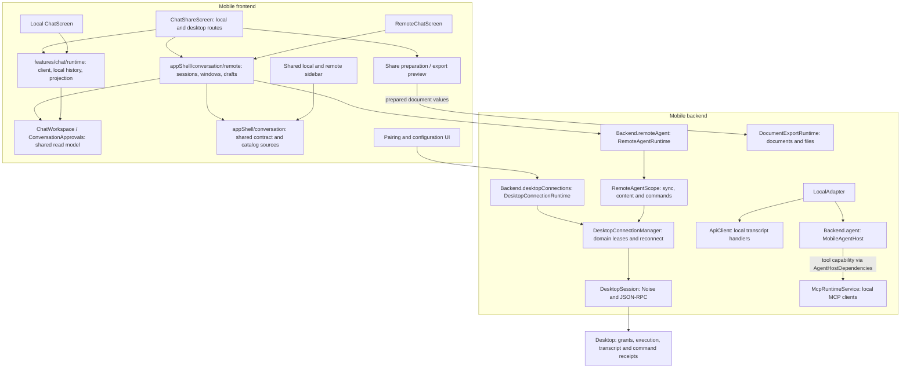

# Service Dependencies And Ownership

Status: source audit of the in-progress #997 migration on 2026-09-23. This describes the current
working tree, including uncommitted implementation; it is not a statement that the remote chat
path has shipped or passed device acceptance. See [Remote Access](./README.md) for the wire contract
and [Runtime Ownership](../runtime-ownership.md) for general lifecycle rules.

## Boundaries And Current Call Graph

Mobile frontend and backend run in one React Native/Hermes runtime. `Backend` and `ApiClient` are
in-process contracts, not separate servers. Only the desktop connection crosses the network.
Frontend sources adapt consumption; the mobile Host or desktop owns execution.

Arrows below mean calls or consumption, not construction ownership. These edges exist in the
working tree. The superseded Controller entry and its agent-version gate are removed.



The desktop chat, sidebar and share routes now use the new consumer. Local regression checks cover
contract behavior; these routes still require device acceptance with the desktop.
MCP here means the mobile MCP capability; desktop tool execution belongs to the desktop.

## Frontend Owners And Actual Consumers

| Owner | Owns | Current integration / boundary |
| --- | --- | --- |
| `ConversationProvider` | Catalog source factory lifetime and desktop catalog eviction | Installed in root layout. Does not dial desktops at construction or own reconnect. |
| `createConversationSources` | Local catalog and retained desktop source wrappers | The only source-kind dispatch. Route encoding can still inspect source kind. |
| `features/chat/runtime` (`ChatProvider`, `useLocalConversation`) | Local observation client, foreground refresh, Query invalidation, Session-keyed history and projection into the shared read model | Local chat and the local share route. Local execution settles in-process; no session lifecycle, revisioned window or operation journal exists on this side. |
| `remote/useConversation` | One remote route's source/session acquisition, activation and cleanup | Used by remote chat and the desktop share route. Offline opening failures retain demand and retry after backend reconnection. Cleanup aborts reads and releases observation, not admitted execution. |
| `ConversationSourceBoundary` | Source acquisition and replacement after retirement for catalog consumers | Used by both sidebars, the Agent picker and remote chat. Each retains its own consumer handle. |
| Remote adapter | Capabilities, freshness, bound actions, revisioned history windows and deferred resource reads | Wraps the credential-free remote module. Does not start another execution engine. |
| `remote/useConversationHistory` and deferred `ResourceRead` values | Scoped Query keys, read cancellation, window lifetime and retirement eviction | Remote chat and the desktop share route. Fixed history versions cannot silently mix; retired bindings cannot reuse old resources. |
| `ChatWorkspace` / `ConversationPresenter` | History/live display reconciliation, stable message rows and presentation | Local and remote chat are connected. Presenter retains live rows through history installation; it does not persist or recover commands. |
| `ConversationApprovals` / message action provider | UI for bound response/retry/fork/remove operations | Local and remote chat are connected. The adapter checks authoritative target/freshness again at invocation. |
| `ChatProvider` / `ChatInput` | Local rich composer, pending first-send rows and navigation handoff | Transitional client extension remains for local admission/model/attachment behavior. They borrow the app-shell client. |
| Chat sharing | Selected IDs, complete immutable transcript preparation, document variants and prepared snapshot release | Both route sources share this path. Underlying local image bytes are not yet pinned. |
| Remote chat/sidebar | Route, source selection and presentation; common catalogs, session/draft actions and operation views | The old Controller provider, queries, polling/resource loaders and gate are removed. |

The common consumption contracts belong in frontend because they describe UI observation and
presentation. Backend does not consume `ConversationMessage` or React Query keys. The separate
`shared/contracts/remoteAgent` surface describes backend reads/actions without credentials,
Noise frames or UI components. These are distinct boundaries, not two competing execution owners. Source draftScope is the stable
identity/grant binding for persisted unsent text; Query scope is a transient consumption generation.
Source operations expose admitted starts without requiring the original Draft view to be reopened.

## Backend Ownership And Lifetime

`ApplicationHost` owns service generations. Bootstrap assembles concrete implementations and
injects their collaborators. Service registration order is documentation; `DependsOn` controls
startup and reverse shutdown. Calls injected with `configure()` are additional dependencies that
must also be considered when reviewing shutdown safety.

| Owner | Resource / authority | Release and recovery |
| --- | --- | --- |
| `MobileAgentHost` | Local turns, approvals, runtime sessions and terminal persistence | Route-independent. Explicit cancel targets a turn. Host shutdown drains; process restart marks unfinished local turns interrupted. |
| `RemoteAgentRuntime` | Shared Agent scopes, concurrent acquisitions, pending command demand | Each caller releases its handle independently. Pending commands retain demand after route exit; stop drains openings and scopes. Process restart recovers journal state when that source is opened again. |
| `RemoteAgentScope` | One Agent-domain lease, session observations, resource registry, read projection and operation recovery | Reacts to lease state; no separate physical reconnect owner. Sync retries and command-receipt recovery are logical work within a usable connection. |
| `RemoteSessionReadCache` | Runtime-owned bounded protocol values, latest history membership, verified bodies | Survives route disposal without retaining network demand. Binding invalidation clears idle data too; current Scope reissues resource references. See [read cache](./session-read-cache.md). |
| `SessionSync` | One observed desktop session's checkpoint and in-memory projection/cursor | Installs a fresh desktop checkpoint on every subscription and applies events in memory before ACK. Background/disconnect stops observation; reconnect never resumes a stored cursor. It never cancels desktop execution. |
| `RemoteAgentActions` | Exact command parameters, fixed IDs, create/send workflow and receipt interpretation | Journal before send. A lost response queries the receipt and may retry identical IDs; interrupted outcomes do not become blind retries. |
| `DesktopConnectionRuntime` | Pair/remove and configuration export/preview/import tasks | Uses temporary pairing channels or configuration leases; aborts and drains workflow tasks at stop. Provider import is this workflow's responsibility. |
| `DesktopConnectionManager` | Physical connection pool, identity/grant bindings, temporary channels and pending dials | Demand-driven; last lease has a short grace period. Owns physical AppState, reconnect and domain retirement. Background closes transport, not PC execution. |
| `DesktopSession` | One Noise channel, typed JSON-RPC requests/notifications, heartbeat and auth refresh | Channel lifetime only; no reconnect, provider import, Agent execution or UI policy. |
| Command journal | Pending commands and unconsumed outcomes in MMKV | Injected into the originating runtime generation. Uncertain commands survive restarts; dismissed terminal records are removed, including empty bindings. The desktop remains authoritative for execution, transcript and receipts. |
| `McpRuntimeService` | Local MCP clients, catalogs and plugin authorization state | Host-owned capability used by local Agent tools and settings. Its MCP connection pool is independent of desktop pairing. |
| `DocumentExportRuntime` | Export sessions, rendering/conversion and output files | Host-owned, foreground-only capability; receives prepared documents and injected file access. It does not read Agent history or choose a desktop. |

The main declared lifecycle edges are:

```text
RemoteAgentRuntime       → DesktopConnectionManager
DesktopConnectionRuntime → DesktopConnectionManager + DbService
DesktopConnectionManager → DbService
DocumentExportRuntime    → DbService
MobileAgentHost          → AgentSessionStore + AgentHostDependencies
                         + BackgroundReplyRuntime + AgentRuntime
AgentHostDependencies    → AgentSessionStore + AiService + PreferenceService
                         + McpRuntimeService + WebSearchService + TraceStorageService
McpRuntimeService        → TraceStorageService
```

`createBackend` additionally injects the MMKV journal, file resolver and
configuration import's model-registry readiness callback. It should remain assembly code; moving
connection decisions there would not make those decisions appropriate for MCP or export.

## Where Connection Decisions Belong

| Decision | Owner | What consumers receive |
| --- | --- | --- |
| Dial, reconnect, authenticate, renew, suspend | Manager + physical Session | Lease state and typed transport outcomes |
| Is this Agent domain/grant still valid? | Manager binding; RemoteAgentScope handles retirement | Retired/unavailable source; no usable old resource refs |
| Is this history current and can this action target still be used? | SessionSync + scope, then consumption adapter | Freshness, optional action, availability reason; action revalidation |
| Show a loading state, disabled action, retry or repair entry | Frontend presentation and navigation owners | Labels and navigation derived from contract outcomes |
| Can a prepared document be rendered? | Export capability and its file dependencies | Export result/error, independent of desktop connection state |
| Can a local MCP tool execute? | Local Host tool admission + MCP capability | Local capability result/error, independent of desktop pairing |

A connected socket is insufficient evidence that a particular grant, projection or action is
usable. Avoid a global `isDesktopConnected` boolean in feature logic. UI may show source status,
but each action consumes its own availability and the source validates again when invoked.

Route cleanup, request abort, explicit execution cancellation, and host shutdown are different
events. A document already prepared should be independent of its source connection; file ownership
must make that promise true. A pending command belongs to the backend journal even after its
initiating view is gone. None of these lifetimes guarantees work during OS suspension.

## Remaining Design Work

These findings come from source inspection, not a reproduction of device failures.

1. **Finish product acceptance and local composer admission.** Remote chat/sidebar now consume
   common catalogs, history, actions, operations and deferred resources. Local composer admission
   still uses its client extension. Remote question answers and advertised system-workspace creation
   now use the matching desktop protocol; denial text is supported by the wire contract but has no
   mobile editor. Verify these paths against the desktop on a device.
2. **Complete prepared asset ownership.** Local selection currently returns `assets: []` and a
   no-op `release`. The share flow holds the transcript snapshot, but the exporter later resolves
   managed image IDs. Introduce a real source-preparation file lease or snapshot-owned copy and
   release it when export closes. Export must not learn how to reconnect to an Agent source.
3. **Audit hidden lifetime edges.** `DesktopConnectionRuntime.import` calls the injected
   `ProviderRegistryUpdaterService.ensureReady`, yet the runtime's declared dependencies contain
   only manager and database. The updater can clear its active registry at stop. Verify concurrent
   import/shutdown and represent the dependency or an explicit drain barrier without forcing
   registry work onto the startup gate. A shutdown failure has not been reproduced here.
4. **Finish pairing channel handoff.** Approved pairing is persisted and the temporary socket is
   closed in `finally`; the manager owns its cleanup, but adoption into the authenticated pool is
   not implemented. Adoption should transfer ownership once, including cancellation and re-pair
   races; pairing/configuration product behavior must stay intact.
5. **Keep dependency claims scoped.** The command journal and document-export file resolution
   capture their originating storage. Existing local capability assembly still uses singleton data
   services, some of which resolve `application.get` on demand. The new graph does not establish
   generation isolation for all older local services; review late work before extending that claim.

These gaps do not require making a universal backend Conversation service or merging MCP/export
into the transport layer. Complete each boundary at its existing owner. The superseded Controller surface is removed. Device acceptance still needs foreground/background, interrupted reads,
receipt recovery, grant revocation, pairing/configuration regression and full remote conversation
coverage against the assigned desktop/mobile instances.

## Source Map

- Assembly: [createBackend](../../../src/bootstrap/composition/createBackend.ts),
  [service registry](../../../src/backend/core/application/serviceRegistry.ts),
  [Backend contract](../../../src/shared/contracts/backend.ts).
- Consumption: [Conversation module](../../../src/frontend/appShell/conversation/README.md),
  [shared contract](../../../src/frontend/appShell/conversation/contracts.ts),
  [remote contract](../../../src/frontend/appShell/conversation/remote/remoteContracts.ts),
  [source dispatch](../../../src/frontend/appShell/conversation/createConversationSources.ts),
  [local runtime](../../../src/frontend/features/chat/runtime/useLocalConversation.ts).
- Remote owners: [Runtime](../../../src/backend/services/remoteAgent/RemoteAgentRuntime.ts),
  [Scope](../../../src/backend/services/remoteAgent/RemoteAgentScope.ts),
  [sync](../../../src/backend/services/remoteAgent/SessionSync.ts),
  [actions](../../../src/backend/services/remoteAgent/RemoteAgentActions.ts).
- Connection owners: [Manager](../../../src/backend/services/desktopConnections/DesktopConnectionManager.ts),
  [workflows](../../../src/backend/services/desktopConnections/DesktopConnectionRuntime.ts),
  [Session](../../../src/backend/services/desktopConnections/DesktopSession.ts).
- Independent capabilities: [Agent host ports assembly](../../../src/backend/ai/agent/host/AgentHostDependencies.ts),
  [MCP runtime](../../../src/backend/ai/mcp/McpRuntimeService.ts),
  [export dependencies](../../../src/backend/services/documentExport/createDocumentExportDependencies.ts),
  [sharing](../../../src/frontend/features/chat/share/README.md).
- Remote frontend path: [source boundary](../../../src/frontend/appShell/conversation/ConversationSourceBoundary.tsx),
  [remote screen](../../../src/frontend/features/chat/remote/RemoteChatScreen.tsx),
  [shared sidebar](../../../src/frontend/appShell/sidebar/components/SidebarConversationList.tsx).
