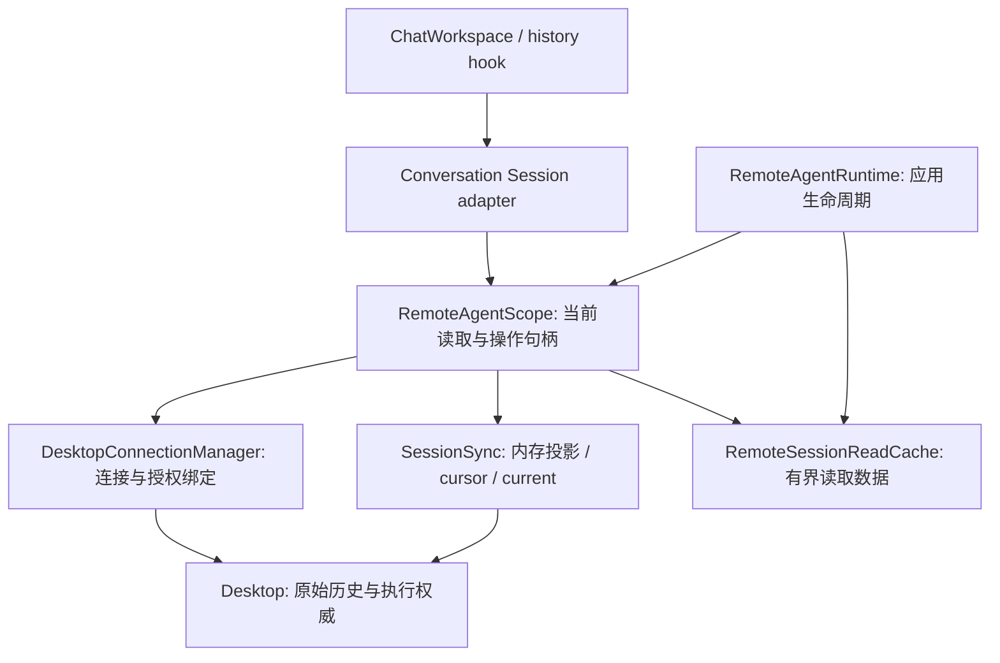
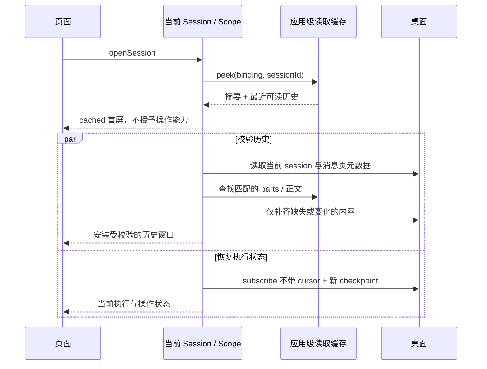

# Remote Session Read Cache

状态：首版已在当前工作区实现，2026-09-23；Android 基础返回流程已验证；原生崩溃阻断完整验收，性能指标仍待测量。
针对移动端 #997 的「切到其他聊天／页面，再回到原远程会话」场景；基于当前工作区，
包括尚未提交的 usage、消息模型和 Agent 当前模型改动。相关背景见
[Remote Access](./README.md) 和 [Service Dependencies And Ownership](./service-ownership.md)。

## 实施记录

- Runtime 持有有界内存缓存，Scope 销毁不清理可读值；新增绑定失效订阅覆盖空闲设备移除、
  替换配对、显式撤权和桌面授权刷新。设备 Data API 只有 GET；写入入口仍在配对／移除工作流
  和连接 Manager，没有增加 UI 到缓存的依赖。
- `peekSession` 与可选 `peekLatest` 已接入，并补充 `subscribeReads` / `subscribePreview`，
  让首次加载中已完成的行渐进出现。共享 history hook 通过外部 store 订阅读取进展；preview
  不设置 installedVersion，后台失败不清空可读缓存。已校验 Query 数据优先于 preview。
- 当前跨页面预览保留最近一页的成员顺序；更早页的 parts/content 可复用，旧 cursor 不保留。
  离开页面后的深层滚动位置恢复不在本轮实现；当前页面的 dataKey 与窗口锚点行为保持原契约。
- 元数据每次进入仍校验，冷启动的 bootstrap 仅供第一次 openLatest 消费一次；并发 session、
  history、parts、content 读取合并。历史和正文 RPC 共用最多 4 个并发名额，订阅／ACK／命令
  不经过这条读取队列。一个消费者取消不影响其他消费者，最后一个取消终止共享纯读取。
- parts 按消息版本复用，正文按完整引用和摘要复用；缓存预算也计算元数据／窗口索引。
  单值超过 1 MiB 不保留，但不阻止当前读取完成。淘汰与授权失效分开，容量不足不会伪装成
  协议版本错误。epoch／历史版本变化通过代次阻止旧窗口写回。
- 桌面审计：`agentQueries` 使用 session.updatedAt / message.updatedAt 生成版本；
  `AiUsageRecordService` 更新消息 stats，Drizzle 的 onUpdate 更新消息时间，但此路径没有
  同时更新 session 时间。因此没有启用“historyRevision 不变就跳过 messages.list”的快捷路径。
  usage/model 元数据仍重新读取；此轮不需要改桌面 wire protocol。
- 本地验证与设备验证分开记录。Mock 覆盖缓存首屏不等 RPC、当前 scope 重绑定、共享取消、
  有界并发、TTL／容量／epoch、删除成员替换和授权失效。Android 16 真机已完成远程 A → B → A、
  设置页返回、深浅主题与同步后输入可用检查；测试文字已清空，没有发送消息。首屏 p95、
  长会话内存和断网／撤权的设备场景尚未测量，不能由 Mock 或 UI 稳定等待时间推断。
- 最后复查发现 RN `ShadowTree.cpp:324` 的 `attempts < 1024` 原生断言崩溃。设备的另一安装包
  在本轮改动前已有相同断言；本次触发条件尚未确定，不能归因为缓存或内存不足。已重新打开
  开发客户端并确认远程正文可恢复，但本轮不标记完整设备验收通过。

以下章节保留设计边界；可调参数与设备性能目标不是测量结果。

## 1. 产品行为与范围

用户返回最近读过的会话时，先看到上次读到的内容，再后台同步桌面变化。读取缓存不要求
连接、订阅、历史校验全部完成。发送、取消和审批仍以当前 Session 的有效操作目标为准。

首版解决同一次 App 运行中的跨页面返回：有上限的内存缓存、资源释放与数据保留分离、
减少历史读取的串行网络往返。进程重启后的完整离线历史、全库同步、附件离线下载和新的
批量协议不属于首版。远程会话状态与同步游标不写入 SQLite；每次重新订阅都从 PC 获取
新快照。待确认命令与尚未消费的结果保留在独立 MMKV 中，按命令回执确认和清理。

## 2. 已确认的现状

| 当前实现 | 返回页面时的后果 |
| --- | --- |
| `useConversationHistory` 的 key 含组件 consumer，cleanup 删除 Query | 已加载历史不能作为跨页面缓存复用；`staleTime: Infinity` 无法改变这一点 |
| `useConversation` cleanup 释放并销毁 Session | 读取窗口和运行期引用失效 |
| `RemoteAgentScope` 最后一个观察者离开即删除 Observation | `SessionSync` 及其 textCache 不跨页面存活 |
| `SessionSync` 在内存中保存协议投影和 cursor | 仅用于当前订阅；重连重新获取 PC 快照，不提供持久化历史缓存 |
| `openSession` 先远程读 session；`history.openLatest` 又读一次 | 命中本地数据的路径仍被远程读取挡在前面 |
| `history` 按消息串行读 parts，再串行读取引用正文 | 一页全部完成才发布；消息和长文本增加等待 |
| 物理连接由 Manager 独立管理，有 3 秒无需求宽限期 | 快速切换未必重连；即使不重连，上述重复读取也存在 |

实现依据：
[history hook](../../../src/frontend/appShell/conversation/remote/useConversationHistory.ts)、
[remote session](../../../src/frontend/appShell/conversation/remote/createRemoteConversationSession.ts)、
[scope](../../../src/backend/services/remoteAgent/RemoteAgentScope.ts)、
[sync](../../../src/backend/services/remoteAgent/SessionSync.ts)。

同一个消费契约不意味着使用同一种底层读取策略。本地已有 SQLite transcript，远程每次
重新读取需要网络往返；共享 UI 不应承担这个成本差异。

## 3. 决策：数据缓存归应用级远程 Agent owner

新增 `RemoteSessionReadCache`，由 `RemoteAgentRuntime` 创建、持有并注入各个
`RemoteAgentScope`。它是该 Runtime 的私有协作者，不单独注册一个生命周期服务。
Runtime 在最后一个页面离开时可以销毁 Scope，但保留有限的读取数据；Runtime 停止时清空。



| 所有者 | 持有 | 页面离开时 |
| --- | --- | --- |
| 页面 / history hook | 可视窗口、滚动锚点、Query observer | 释放读取与订阅 |
| Conversation Session | 当次 scope 的 refs、HistoryWindow、操作闭包 | dispose，不进入长期缓存 |
| RemoteSessionReadCache | session 摘要、历史页成员与顺序、消息版本、parts、已验证正文 | 保留至 TTL／容量淘汰／绑定失效 |
| SessionSync | 当前订阅的内存同步游标和 live 状态 | 停止订阅；下一次订阅重新获取 PC 快照 |
| DesktopConnectionManager | 连接、domain lease、前后台与重连 | 保留现有策略 |

React Query 继续管理当前读操作的 loading/error/取消/分页，不引入第二套前端状态库。
运行期 Query 的 consumer key 和 cleanup 可以保留：真正可复用的值移到更长寿命的 owner。
现有 catalog 的 React Query 五分钟缓存也保持原职责，不用于存 transcript。

## 4. 缓存的内容与身份

### 4.1 稳定 binding 与运行期 scope 分离

- 使用 Manager 已有稳定 `lease.scope` 作为缓存 binding：其来源包括 connectionId、
  desktopIdentity、deviceId、domain、grantId；不含 IP、端口或随机 Scope UUID。
- 会话键为 `(binding, sessionId)`；消息键再加 `(messageId, messageRevision)`。
- `RemoteAgentScope.scope` 仍是当次运行期引用的 owner，不改成永久有效。
- `streamEpoch` 变化需要重建同步／成员索引，不能沿用旧分页 cursor；内容字节若完整摘要匹配，
  可以继续复用。它不是授权绑定变化，不必把所有已验证正文当作无效。

### 4.2 存值，不存能力

缓存内部保存协议的纯值：session/message/part DTO、成员索引、完整性状态和读取时间。
正文按 binding、sessionId、contentId、revision、sha256 寻址，写入前验证完整长度和摘要。
可保留无执行权的内容描述符，但读取仍经过当前 Scope 的正常校验。

不缓存 `ConversationSession`、`HistoryWindow`、AbortController、订阅 ID、分页游标、
send/cancel/respond target、操作闭包或旧 `RemoteResource` 字符串。现有 `RemoteMessageView`
本身带有运行期 resource token，不能直接整包作为长期缓存。

重新读取时由当前 Scope 用缓存原始值生成新的 `RemoteMessageView` 与 resource token；
前端再按当前 scope 生成 MessageRef/ResourceRef。旧 handle 失效后仍然不可用。

### 4.3 两种索引不混用

- 历史窗口索引记录某次完整读取的成员顺序、historyRevision、首尾消息及是否还有更早消息。
- 消息／正文实体用于复用昂贵内容；不能仅凭实体集合重建会话顺序、推断消息是否已删除。
- 最近窗口可复用多个已读页。返回先展示最近缓存；需要继续分页时建立新的受校验窗口，
  不恢复旧 cursor。需要恢复更深滚动位置时保存稳定 messageId 锚点，不保存像素值为协议状态。
- tool output、附件等大资源默认按需读取。只缓存实际读取且验证过的值，不做全量预取。

## 5. 会话消费契约

以下说明已落地契约的语义，具体 TS 类型以 public surface 为准。

### 5.1 Backend.remoteAgent

`RemoteAgentSource` 增加一次纯缓存读取：

```ts
peekSession(sessionId: string): RemoteSessionReadPreview | undefined
```

`RemoteSessionReadPreview` 含 session 摘要、可选的最近历史窗口、读取时间和完整性标记。
它没有 `current: true`、操作目标或有效分页 cursor。返回的展示 DTO 已绑定到当前 Scope，
不是缓存内部原始对象的可变引用。缓存 miss 立即返回 undefined，不触发联网。

`readSession/history/readResource` 继续表示需要验证的读取，由 Scope 使用缓存中的原始值
复用 parts/content。首版不把 `readSession` 悄悄改成“可能过期但叫 current”的接口。

### 5.2 Frontend Conversation

- `createRemoteConversationSource.openSession`：binding 合法且有 session 摘要时，直接构造
  cached Session；没有摘要才执行当前远程 bootstrap。进入页面不等 `lease.ready()` 才看缓存。
- `ConversationHistory` 增加可选的同步 `peekLatest()`，返回只读 HistoryPreview：
  `items`、`version`、`readAt`、`hasOlderMessages`，没有分页 cursor 或可执行动作。
- `useConversationHistory` 无已安装数据时先显示 preview。新增／明确 `isRefreshing`，
  `isLoadingInitial` 仅表示连可展示数据都没有；共享 UI 不判断 local/remote。
- preview 的 version 仅描述缓存来源，不能直接写入 `installedVersion`。只有校验成功的
  HistoryWindow 才能完成 history/live 交接，防止旧历史把新终态消息挤掉。
- 当前 Query 的已完成页面、preview、live overlay 按稳定 messageId 合并去重；
  不将 preview 假装成仍持有有效 cursor 的 React Query page。
- 本地 adapter 首版可不提供 peekLatest，继续读取本地 transcript；公共 UI 行为不回退。

最近历史的首屏是只读展示。同步未完成时保留现有“同步中”操作状态；纯文本浏览不受影响。
新鲜度不足时不复用 retry/delete/fork/审批等旧动作。完整导出仍通过 prepareSelection
建立一致的完整快照，不能将未校验的局部缓存冒充完整导出。

## 6. 返回页面与校验顺序



具体约束：

1. session 元数据读取按同一激活周期合并 in-flight 请求，openSession 和 openLatest 不重复
   发起同一读取。不用任意时间 TTL 将刚才的 metadata 自动当作最新。
2. 每次激活都后台校验。首版仍读取最新 messages.list 元数据，以更新 usage/model 等字段；
   匹配的 parts 和正文无需重新下载。
3. 不以“session historyRevision 没变”跳过所有读取。现有版本源是 updatedAt；桌面 usage
   物化等写路径需要审计是否同时推进 session 的历史版本。只有相关写路径与测试保证覆盖后，
   才能采用完整的 unchanged-version 快捷路径。
4. 一页 parts 缺失项采用有界并发，默认最多 4 个远程读取任务，保证输出顺序。整个 source
   共用该预算，不嵌套扩大为每条消息各 4 个；为同步、ACK、命令保留协议 in-flight 余量。
   已排队的纯读取服从取消；不修改 DesktopSession 的协议上限。
5. 有缓存时校验过程不遮挡已有内容。无缓存时先让最新可读消息出现，长正文与推理按需补齐，
   不能把“部分可展示”发布成“整个历史窗口已安装”。实际分块发布作为 slice 2 的契约测试点。
6. 较慢的工具详情和 interactions 元数据不应挡住正文展示；发送／审批是否可用仍由同步状态决定。

## 7. 完整性、并发与失效

| 情况 | 处理 |
| --- | --- |
| 普通页面退出／连接空闲关闭／暂时离线 | 释放读取句柄；保留受限数据并标记待校验 |
| 同 binding 两个页面读取同一内容 | 共享 in-flight 任务与结果；一个消费者取消不能取消另一个仍需要的任务 |
| 最后一个读取者离开 | 取消排队／执行中的纯读取；完整验证后的数据可留存；不影响 admitted command |
| late response 属于旧激活代次 | 不覆盖新窗口；只有 binding 仍有效、完整验证且符合当前写入代次的实体才能提交 |
| historyRevision 改变 | 丢弃当前窗口的分页资格，重新校验可见窗口成员；旧显示值作为 cached 暂留 |
| 编辑、删除、重新生成 | 匹配新成员／新版本后原子安装窗口；删除数据不得被晚到请求复活 |
| 事件缺口、订阅重置或 streamEpoch 改变 | 重新获取 PC checkpoint；重校验历史索引；强摘要正文可以复用 |
| NOT_FOUND | 清除该 session 的 preview 与读缓存，显示不存在，不能继续当作正常历史 |
| GRANT_REVOKED／FORBIDDEN／替换配对／移除设备 | 立即清除相关 binding，并让旧任务不能重新写入 |
| configuration grant 改变，Agent binding 未变 | 不误删 Agent 缓存；保持 domain 隔离 |
| App host 替换／Runtime 停止 | 清空旧 host 的缓存与任务，不能写进新 host |

`history.committed.messages` 不是全量成员清单，也不是完备删除日志。可作为哪些实体需要
刷新的提示，不能据其缺席删除其他消息；删除与窗口成员关系以重新读取的完整窗口为准。
ACK（向 PC 确认已处理的事件位置）在事件成功应用到当前内存投影后发送，不再依赖数据库
事务。缓存命中不能代替协议事件校验；断线后不复用旧 ACK 位置，重新获取 PC 快照。

失效不能依赖“当前有页面”：缓存所在的 Runtime 需要接收设备绑定变化，包括空闲期间的
删除、重新配对和撤权。现有活跃 lease 回调不覆盖所有空闲缓存。实现时给 DesktopConnections
增加 domain-neutral 的 binding invalidation 订阅，由 Manager 在 invalidate/revoke 发布；
invalidate 即使没有活动 entry 也要发布。配对／移除沿用现有调用点。RemoteAgentRuntime
消费该事件清理自己的缓存；Manager 不依赖 Agent 历史，也不操作前端 Query。该端口需同步
覆盖其他已知设备目录写入口，不能只覆盖设置页。

## 8. 首版容量和生命周期

初始策略集中在 `remoteReadCachePolicy.ts`，以下是可调默认值，不是已测定最优值：

- 最多保留 10 个非活跃会话；非活跃 5 分钟过期。活跃会话仅保留受限的可见／最近窗口。
- 所有正文和 parts 合计按估算字节设置 32 MiB 硬上限；单资源超过 1 MiB 不纳入长期内存缓存，
  读取仍可正常完成。元数据／窗口索引也计入预算，不仅统计字符串。
- 淘汰顺序：非活跃 LRU、窗口外正文、较早窗口；活跃视图持有的引用不等于缓存无限 pin。
  32 MiB 指 owner 的保留预算，不宣称是 Hermes 总堆上限。
- 每次 lookup 校验过期，在写入／读取时清理；无需为了缓存维持连接或每会话常驻计时器。
- 远程协议投影与读取缓存均不写入 SQLite；重启后以 PC 新快照为准。待确认命令使用
  独立 MMKV，不能按读取缓存的过期或容量规则淘汰；终态结果消费后清理，空条目直接删除。

## 9. 文件组织与实现切片

主要实现位置如下；没有新增根目录，也没有修改 MCP 或 DocumentExportRuntime。

| 文件／模块 | 职责 |
| --- | --- |
| `src/backend/services/remoteAgent/RemoteSessionReadCache.ts` | 纯值索引、容量／TTL、binding 隔离、写入代次；Runtime 私有协作者 |
| `src/backend/services/remoteAgent/RemoteReadCoordinator.ts` | 共享纯读取的消费者取消和 source 级 RPC 并发预算 |
| `src/backend/services/remoteAgent/remoteReadCachePolicy.ts` | 集中容量与读取并发参数 |
| `src/backend/services/remoteAgent/RemoteAgentRuntime.ts` | 持有缓存、注入 Scope、监听绑定失效、停止时清理 |
| `src/backend/services/remoteAgent/RemoteAgentScope.ts` | peek、当前 scope 重绑定、缓存读取协调、in-flight 合并与消费者取消、有界并发 |
| `src/backend/services/remoteAgent/SessionSync.ts` | 发布恢复进度／历史变更提示；复用完整正文的受限读缓存；不移交 cursor ownership |
| `src/backend/services/desktopConnections/connectionPorts.ts` / `DesktopConnectionManager.ts` | 增加不依赖 Agent 的 binding invalidation 通知 |
| `src/shared/contracts/remoteAgent/views.ts` / `module.ts` | 无凭据的 preview DTO 与 peekSession 契约 |
| `src/frontend/appShell/conversation/remote/remoteContracts.ts` | 可选 HistoryPreview 消费能力 |
| `src/frontend/appShell/conversation/remote/*` | cached bootstrap、preview 投影、有效引用重建、历史校验周期合并 |
| `src/frontend/appShell/conversation/remote/useConversationHistory.ts` | preview 与已安装窗口分开；刷新不清屏 |
| `src/frontend/features/chat/components/ChatWorkspace/*` | 有可读缓存时不显示首次加载遮罩，保留滚动锚点 |

Slice 1：完成纯值缓存、稳定 binding、peekSession/peekLatest、缓存首屏和失效机制；保留现有
联网读取作后台校验。先解决返回页面没有内容可看的问题。

Slice 2：完成正文／parts 复用、重复请求合并、有界并发和渐进显示；解决后台校验仍然昂贵，
以及无缓存首次打开的串行等待。缓存资源与旧 handle 的边界在此闭环。

Slice 3：补全版本变更、删除、epoch 更换、多消费者取消等回归及设备测量；审计桌面元数据
更新与历史版本关系。未证明的版本快捷路径保持关闭。

前三片可在现有协议上完成，不新开 PR 层，移动端继续 #997；如版本审计需要桌面修复，更新
现有桌面 PR。可选的服务端历史批量页放在测量之后：使用有字节预算的增量协议，协商后启用，
旧桌面保留当前 methods 回退；不要一开始就扩大 wire record 或返回无限正文。

## 10. 验证与验收

实现时按 [Testing And CI](../../guides/testing-and-ci.md) 测试最低 ownership；不新增屏幕
render suite。设备工作另按 [Parallel Device Testing](../../guides/parallel-device-testing.md)。

固定测试覆盖：

- A → B → A：第二次 A 的第一批可见数据来自缓存，即使所有远程 reads 暂不返回；并有后台校验。
- 同消息版本／相同正文摘要：复用 parts/content；元数据 usage/model 改变仍更新。
- 单条消息改变：仅补缺失内容；删除、历史重排、live→history 不产生重复、丢失或旧数据复活。
- 两个消费者复用任务，取消一个不影响另一个；最后一个退出释放纯读取。
- preview 从不恢复旧 cursor、操作目标、审批回调或 ResourceRef；相同 IP 的新绑定也不得命中。
- 离线有缓存时可读但不能发送；NOT_FOUND／撤权清空；空闲期间删除设备也清空。
- epoch/reset、TTL／LRU／超大资源、部分失败与较晚旧响应均有确定行为。
- 共享 hook 的本地分页、消息定位、选择导出及 history/live 交接回归保持通过。

设备测量按会话大小、长文本、工具结果和连接状态分组，至少包含同一桌面 A → B → A、
跳到本地后返回、连接已空闲关闭后返回。分别记录：

1. 路由激活 → 首批可读消息完成布局；
2. 路由激活 → 同步到 current／操作可用；
3. 各 RPC 数量、正文下载字节、缓存命中／淘汰、峰值保留字节；
4. 滚动锚点是否保持、前后 p50/p95、失败场景是否保留已有内容。

首要验收条件是因果关系：命中缓存的首屏不等待远程 RPC；未变化的完整正文不重复下载。
可暂定缓存命中首屏 p95 ≤ 200 ms 作为优化目标，但必须记录 Android 设备、样本量和实际结果；
未测量前不承诺速度，不用 Mock 测试通过替代端到端验收。
