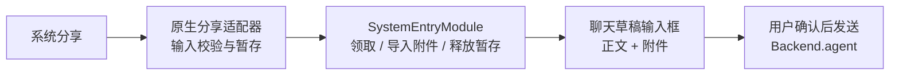

# 系统分享架构方案

状态：源代码已接入，原生构建与真机验收仍需单独授权。日期：2026-09-21。关联：[Issue #964](https://github.com/CherryHQ/cherry-studio-app/issues/964)。

## 1. 设计结论

本次系统集成只保留一个核心能力：外部应用通过系统分享把文本、链接、图片或文件交给 Cherry。

分享不是一次提交，而是**给聊天输入框喂料**：内容直接落到聊天草稿，文本进输入框、附件进附件条，
由用户自己决定改什么、换哪个 Agent、什么时候发送。因此没有独立的分享确认页。

- `SystemEntryModule`（系统入口模块）负责领取、校验、导入附件和释放原生暂存。
- App Shell（应用外壳，即负责全局导航与启动衔接的前端层）负责打开聊天草稿并交接给输入框。
- 分享继续复用现有 Agent、输入框与文件能力，不建立第二套聊天或文件运行时。
- 不提供桌面快捷入口、App Intent（iOS 系统快捷指令入口）或通用命令总线。

## 2. 所有权与数据流



主应用的 `Backend`（前端调用后端工作流的同进程接口）不是跨进程传输层。iOS 分享扩展运行在
独立进程中，因此先写入 App Group（应用及扩展共享的受控容器）；Android 接收页把内容写入应用
私有目录。应用启动后由唯一的前台消费者领取。

## 3. 动作契约

```ts
type SystemAction = {
  kind: 'share.receive';
  text: string;
  files: readonly SystemSharedFile[];
};
```

`claimNext()` 一次只领取一条分享：导入附件到文件库，释放原生暂存，然后返回内容。返回时调用方
不再持有任何需要释放的资源，因此没有会话对象、没有确认接口，也没有提交幂等收据。

外部分享不能直接发送，也不能指定工具、模型服务商、请求地址、密钥或本地文件路径。

## 4. 产品规则

- 落点是**新草稿**，Agent 取「新对话」的同一套解析：当前聊天的 Agent，否则列表第一个。
- 分享到达时会**新开一个输入框会话**，覆盖此前未发送的草稿。
- 之后切换 Agent **保留**输入框内容：正文和附件属于用户，不属于它们写下时的那个 Agent。
- 没有可用 Agent 时不领取，分享留在暂存区等下一次前台。
- 一次只领一条。前台期间连续分享，后到的覆盖先到的；先到的附件已经在文件库里。

## 5. 分享存储与限制

- 文本最多 131,072 个 UTF-16 单元；附件最多 10 个。
- 单附件最多 25 MiB，总附件最多 50 MiB；链接只保存文字，不主动下载。
- 未领取的分享最多暂存 24 小时，领取、丢弃或过期后清理。
- iOS 文件使用完整文件保护并排除备份；Android 使用 `noBackupFilesDir`。
- 原生端限制附件必须位于本次暂存目录，JavaScript 再通过版本化 schema 校验。
- 附件一旦导入即归文件库，与从 ＋ 菜单选文件语义一致：不发送也不会回收。
- 领取后的分享只活在输入框里。进程被杀，未发送的草稿就没有了；导入中断则整条分享留在暂存区，
  下次领取重新导入全部附件，可能留下一份重复文件。
- 路由只携带内存句柄，不携带正文或文件路径。

## 6. 原生集成

`scripts/withSystemIntegration.js` 生成 iOS 分享扩展及 App Group 权限。Android 分享 Activity
由本地 Expo 模块注册。`app.config.ts` 按 development、preview、production 的包名隔离共享
容器；Widget 继续使用原有 App Group，不获得系统分享暂存区。

新增或修改这些原生入口后必须重新构建自定义客户端；OTA 更新和 Expo Go 不能增加原生模块或
分享扩展。

## 7. 验收重点

获得构建与设备验证授权后，覆盖冷启动和热启动分享、附件上限、过期清理、连续分享、带草稿切换
Agent、App Group 签名权限以及确认发送。自动化验证重点覆盖 `createSystemEntryModule`、原生
envelope schema、聊天路由的交接参数、输入框会话规则和 bootstrap 释放顺序。
